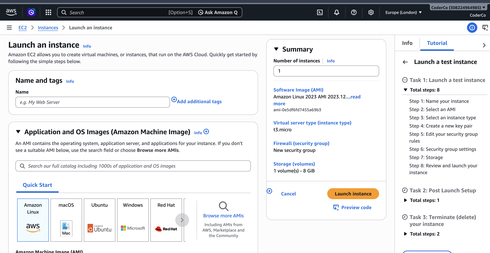

# Welcome to my Networking project! 

For this project i deployed a NGINX web server on an AWS EC2 instance, connecting it with an custom domain purchased on Cloudflare.

# The tools i used...

- 'AWS EC2'
- 'Security groups'
- 'Cloudflare DNS'
- 'Key pair'

## 1. Launch an EC2 instance : 
Firstly i created my EC2 instance configuring it to the needs of this project.

- AMI (Amazon Linux)
- Instance type - 't3.micro' (Utilising the free tier.)
- RSA pair - Added a Key pair so that i can connect with SSH securely.
- Inbound security group rules: 
    - Allowing SSH (Port 22) only to my IP address to ensure security
    - Allowing HTTP access (Port 80) on the 0.0.0.0/0 so that any IP address can access the web page.

