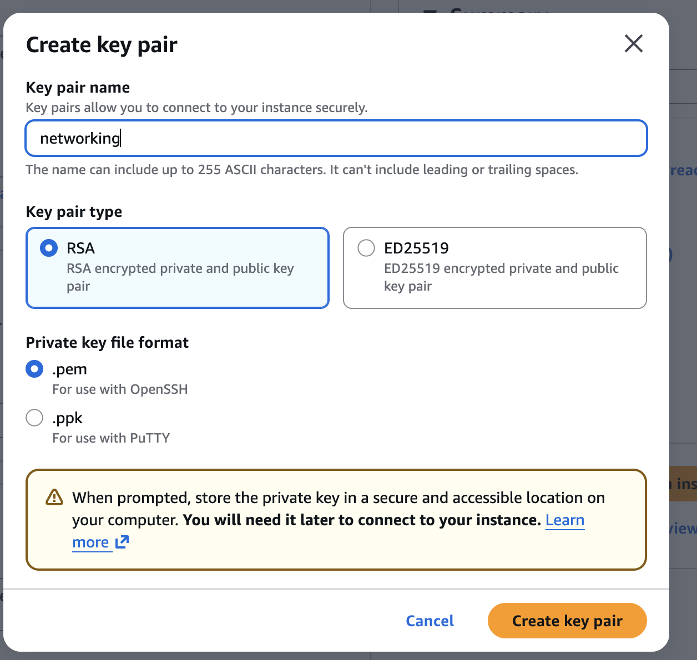
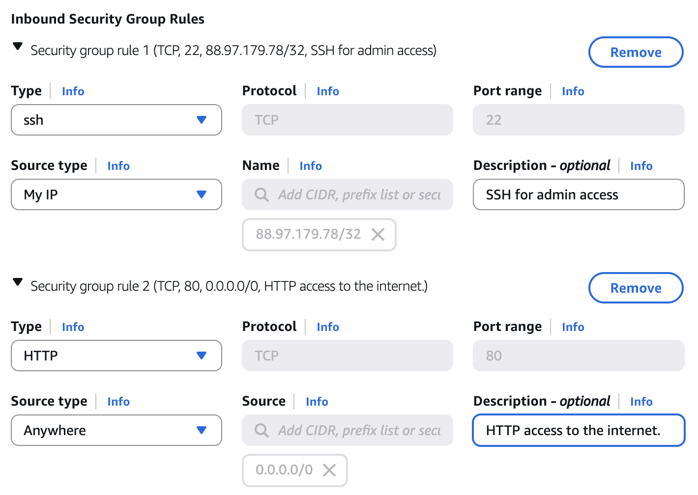
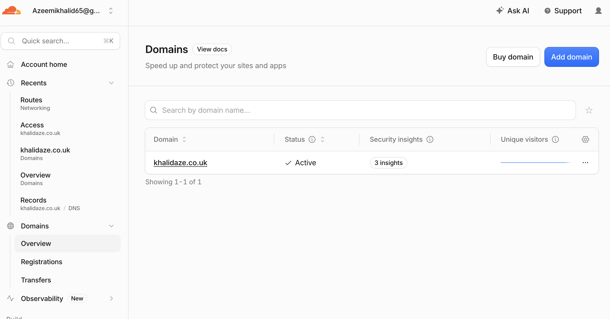
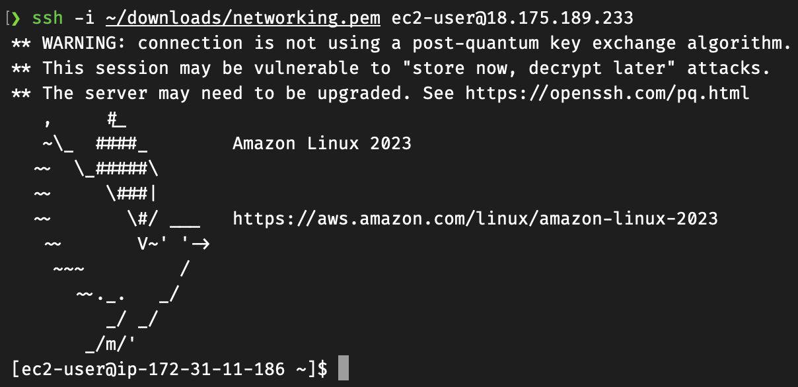
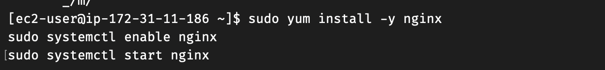
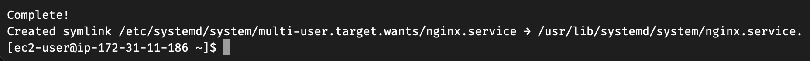
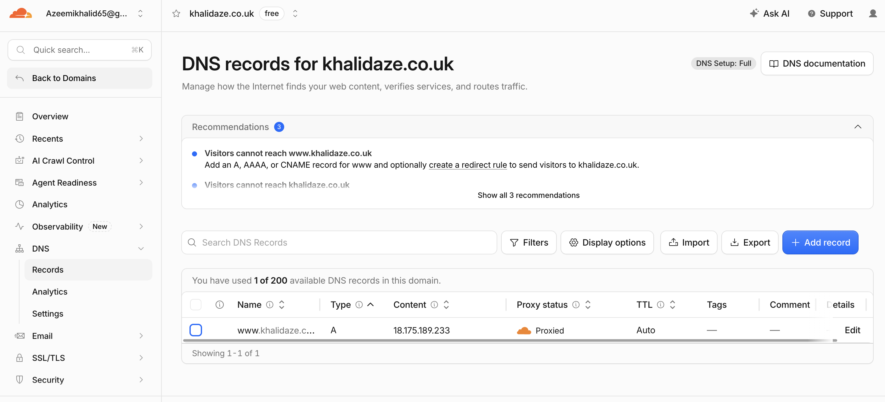
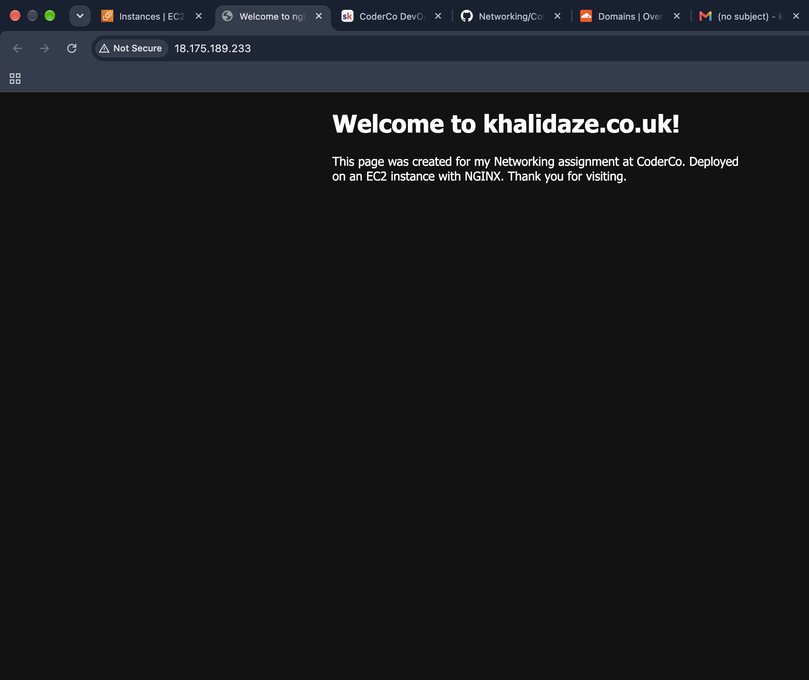

# Welcome to my Networking project! 

For this project i deployed a NGINX web server on an AWS EC2 instance,connecting it with an custom domain(khalidaze.co.uk) purchased on Cloudflare.

# The tools i used...

- `AWS EC2`
- `Security groups`
- `Cloudflare DNS`
- `Key pair`

## 1. Launch an EC2 instance : 
Firstly i created my EC2 instance configuring it to the needs of this project.

- AMI (Amazon Linux)
- Instance type - `t3.micro` (Utilising the free tier.)
- RSA pair - Added a Key pair so that i can connect with SSH securely
- Inbound security group rules: 
    - Allowing SSH `(Port 22)` only to my IP address to ensure security
    - Allowing HTTP access `(Port 80)` on `0.0.0.0/0` so that any IP address can access the web page.

## 2. Purchase my domain :
Once my EC2 was configured and safely running i then purchased a domain with my name (khalidaze.co.uk) on Cloudflare.

# 3. Connect to my EC2 instance
Having purchased my domain and my EC2 running, i now needed to connect to my EC2 to install NGINX.

Command used: `ssh -i ~/downloads/networking.pem ec2-user@18.175.189.233`

This is where i used the RSA key pair i created within my instance (networking.pem) alongside the public IPv4 address initiated with my EC2 to connect to my instance.

# 4. Install NGINX web server
Now that i had accessed my EC2 from the CLI i can now install the NGINX software. A good point to mention is that this could have been done in the User Data area when i was configuring my EC2, However i chose to SSH to test the alternative route.

Commands Used:

`sudo yum install -y nginx`
`sudo systemctl enable nginx`
`sudo systemctl start nginx`

# 5. DNS Record
All that was left to do was to point my DNS to the public IPv4 address generated by my EC2. This is done by creating an (A) record on the Cloudflare website.

# 6. The final result!

